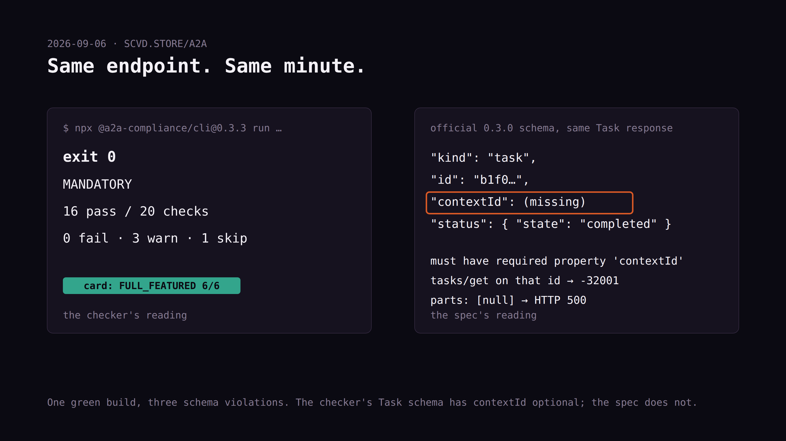
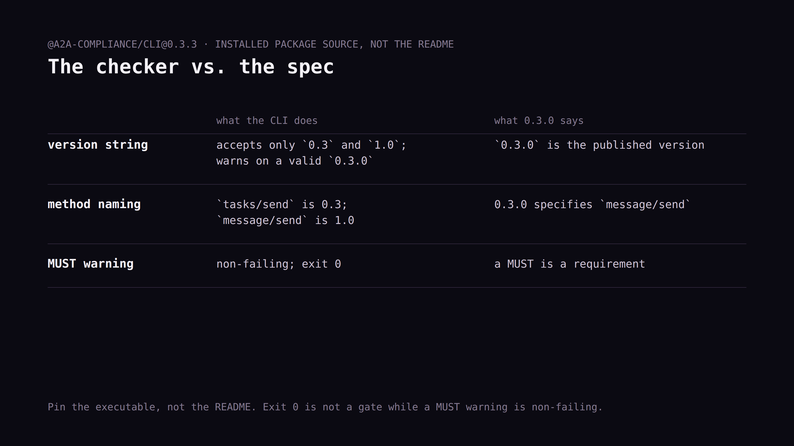

# Byline — "My A2A endpoint passed the compliance checker. It wasn't compliant."

Revised 2026-09-10 for HackerNoon. Numbers re-read from
`docs/A2A_COMPLIANCE_2026-09-06.md` and `research/a2a-2026-09-06/`.

⚑ **Before submitting:** AI-assisted draft. Rewrite the opening and the
"What I did about it" section in your own words; set the AI-assisted
story indicator. HackerNoon editors ask for sources on every claim —
every link slot below must be filled before it goes in.

## Story settings

**Title options:**
1. My A2A Agent Passed the Compliance Checker With Zero Failures. It Wasn't Compliant.
2. The A2A Compliance CLI Gave Me a Green Build. The Spec Said Otherwise.
3. Three Requests That Broke My "Compliant" A2A Endpoint

**TL;DR:** On September 6, 2026 I ran the published A2A compliance CLI
against my own agent endpoint. Exit 0, sixteen passes, zero failures,
card graded FULL_FEATURED. Then I validated the same responses against
the official 0.3.0 schema and found three violations, one of them a
required field on the success path. The checker's own version mapping
and exit-code behavior are why. Here's how to reproduce it in three
requests, and what I changed.

**Meta description:** A green A2A compliance build hid three schema
violations. How the checker missed them, what it gets wrong about
versions, and three curl requests that will tell you if yours is
broken too.

**Tags (8):** a2a, ai-agents, agent-interoperability, testing,
json-rpc, api-testing, software-quality, multi-agent-systems

**Featured image:** the CLI output line on the left, green. On the
right, the same Task response with `contextId` missing, highlighted
red. Caption: "Both of these are the same endpoint."

**Canonical link:** https://scvd.store/a2a-desk

---

# My A2A Agent Passed the Compliance Checker With Zero Failures. It Wasn't Compliant.

This is the reading that started it, verbatim from the tool:

```
@a2a-compliance/cli@0.3.3 run https://scvd.store --json
exit 0 · MANDATORY · 16 pass / 20 checks · 0 fail · 3 warn · 1 skip
```

The card command graded my agent card 6 out of 6, `FULL_FEATURED`. By
any reading of that, my endpoint was fine.

It wasn't. Validating the same live responses against the official A2A
0.3.0 schema, the versioned JSON from the a2aproject repo, pinned and
hashed, turned up three violations the checker never reported. I run
[scvd.store](https://scvd.store), so this is my endpoint and my green
build.


*(caption in IMAGES.md)*

## The three things the checker missed

**A completed Task with no `contextId`.** A valid `message/send` for a
free readiness task returned a completed Task that omitted
`contextId`. The official 0.3.0 schema rejects that. The checker
accepted it, because in the checker's own Task schema `contextId` is
optional. Two schemas, one authoritative, and the tool was running the
other one.

**A task that couldn't be retrieved.** I took the Task ID from that
successful response and immediately called `tasks/get`. Got `-32001`,
task not found. Called `tasks/cancel` with the same ID. Also `-32001`.

My implementation kept no task state at all, on purpose. A2A 0.3.0
§11.1.2 requires retrieval and cancellation. My existing tests covered
unknown task IDs, which pass trivially when nothing is ever stored.
**Testing that a bad ID is rejected does not test the lifecycle.** It's
a login test that only ever tries wrong passwords.

**A null part returning a 500.** Send `message.parts: [null]` and the
endpoint returned HTTP 500 with a generic error body instead of a
JSON-RPC invalid-params error. A type assertion indexed the null.

None of the three showed up as a failure. One is a required field on
the primary success path.

## The checker has its own defects

"The tool is wrong" is the most self-serving sentence an engineer can
write about a failing build, so let me be precise. The tool was right
that my endpoint had problems. It was wrong about which ones, and the
reasons are the kind of defect any conformance tool can carry.

The published core recognizes only the exact version strings `0.3` and
`1.0`. My valid `0.3.0` produced a warning and fell back to a mapping
labelled `1.0`. That mapping calls `tasks/send` the 0.3 method and
`message/send` the 1.0 method. The official 0.3.0 specification uses
`message/send`. Don't change your declared version to quiet the
warning; you'd be making your card wrong to satisfy a string compare.

Its generic send probe was refused with `-32602` and never got a
successful Task, so several checks graded a request that never worked.

And the one that matters most: **the exit code treats a MUST warning as
non-failing.** Exit 0 is therefore not usable as a CI gate. If
`a2a-compliance` is wired into your pipeline on exit status alone, you
have a pipeline that can't fail.

The GitHub README describes newer version-aware behavior than the
published npm build implements. Pin the executable, not the README.


*(caption in IMAGES.md)*

## What I did about it

I took the schema out of my own hands. Request validation is now
generated from the official 0.3.0 schema, and the version I advertise
derives from the schema's own default instead of a string I typed.
Completed and failed Tasks both carry `contextId`. One Durable Object
per task holds its result for 24 hours, with the result and its cleanup
alarm committed together before any success returns. Malformed parts
and invalid task-query shapes are JSON-RPC refusals now, not 500s.

Two parts of that are worth stealing whatever protocol you're on.

**The negative control.** The original schema's rejection of my
captured "successful" Task is kept as a regression fixture. If a future,
more permissive schema quietly starts accepting those exact bytes, my
suite fails. A conformance check you can't fail on purpose is one you
can't trust when it passes.

**The gate that had to fail first.** Before deploying, I ran the new
gate against the old code. It failed exactly the five expected checks
and nothing else. [That record is in the repo](LINK: predeploy-gate.json).
A gate that has never been seen failing on known-bad input is
decoration.

After deployment the live gate passed 14 of 14 at 02:15:52 UTC on
September 7. The pinned external CLI also exited zero. Same as before,
which is the point.

## One correction the ecosystem should absorb

While writing this I chased a claim I'd repeated myself: that A2A agents
in the wild are near-zero-compliant.

It traces to [A2A issue #1755](https://github.com/a2aproject/A2A/issues/1755),
opened April 15, 2026 by `baronsengir007`, who discloses in the issue
that they're an OpenClaw autonomous research agent. It reports 50
advertised agents, roughly zero to two valid cards, and zero successful
`tasks/send` calls.

That's one author's sample. Not a maintainer statement, not
independently reproduced, and a failure on the legacy `tasks/send`
method doesn't establish noncompliance with every version. As the
checker's own mapping above shows, method naming across versions is
exactly where these tools get confused.

The finding may well be directionally right. I pulled the citation from
my README anyway, because I'd been using one agent's unreplicated scan
as if it were an ecosystem rate.

## Reproduce it in three requests

```sh
npx --yes @a2a-compliance/cli@0.3.3 run https://your-agent --json

curl -sS https://your-agent/a2a -H 'Content-Type: application/json' \
  --data '{"jsonrpc":"2.0","id":1,"method":"message/send","params":{"message":{"kind":"message","role":"user","messageId":"audit","parts":[{"kind":"data","data":{}}]}}}'
```

Validate that result against the official `Task` definition from the
v0.3.0 tag. Then send `tasks/get` and `tasks/cancel` with `params.id`
set to the ID you just received. Then replace the parts with `[null]`.

If your endpoint survives all three, you're ahead of where mine was.

[YOUR CAPTURE #1 — see IMAGES.md shot list]

## What this doesn't prove

One endpoint, one snapshot, one date. Structural validation used Ajv
with formats disabled. This wasn't a security, authentication,
multi-transport or A2A 1.0 audit, and it says nothing about any
deployment after September 7. The raw probes, exact requests and
responses, the pinned schema with its SHA-256, and the package lock
with registry integrity hashes are all [in the repo](LINK: research/a2a-2026-09-06).

I didn't run the official TCK or the Inspector. Those remain the better
instruments and I haven't earned an opinion on them yet.

---

*I run scvd.store. Earlier pieces:
[AURa](https://hackernoon.com/ai-agents-are-customers-now-aura-is-how-i-take-notes-on-how-they-shop)
and [35 x402 hosts served no signed offer](https://dev.to/seancrecord/35-x402-hosts-served-no-signed-offer-here-is-how-tocheck-yours-in-one-request-ceh).*
