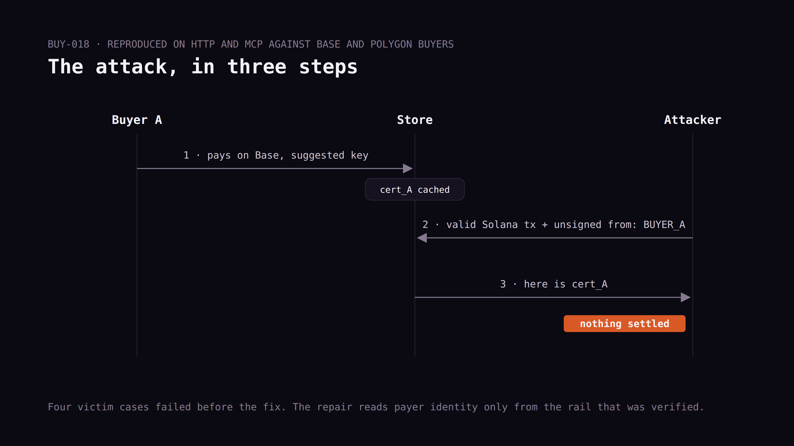
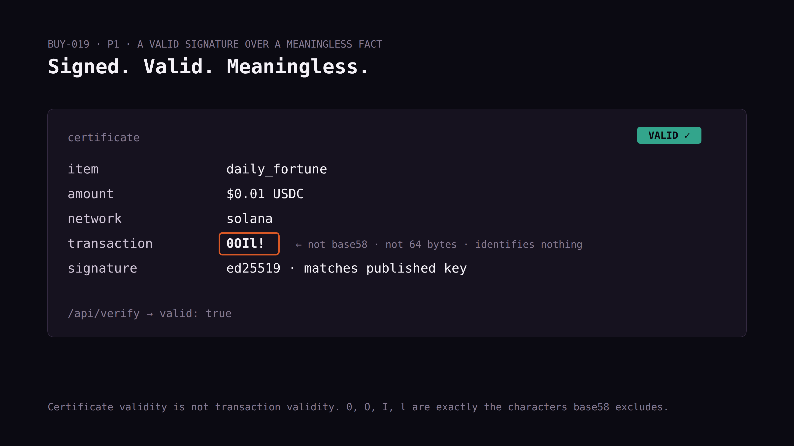
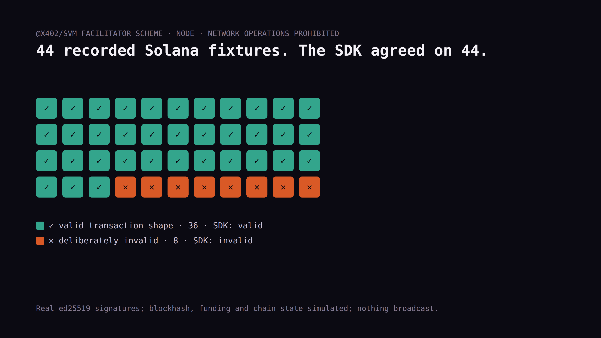

# Byline — "A Solana signature can claim an Ethereum buyer's receipt"

Revised 2026-09-10 for HackerNoon. Numbers re-read from
`research/buyer-cross-rail-2026-09-06.md` and `BUYER_AUDIT_LOG.md`.

⚑ **Before submitting:** AI-assisted draft. Rewrite "Defect one" in your
own words at minimum; set the AI-assisted indicator. Fill every link
slot; HN editors bounce unsourced claims.

## Story settings

**Title options:**
1. A Valid Solana Signature Claimed Another Buyer's Ethereum Receipt. The Signature Was Never the Problem.
2. I Added Solana to My x402 Store. A Solana Signer Could Then Steal EVM Receipts.
3. Two Bugs Every Multi-Chain Payment Endpoint Is About to Ship

**TL;DR:** On September 6, 2026 a cross-rail audit of my own five-network
x402 checkout found that a cryptographically valid Solana payer could
retrieve an EVM buyer's paid artifact without settling anything. The
Solana signature verified correctly. My code read the field next to it.
A second finding: a settlement identifier of `0OIl!` was signed into a
certificate that my public verifier called valid. Two rules fall out,
and I think every multi-chain endpoint being built right now needs both.

**Meta description:** Adding a second chain to a payment endpoint
creates a new class of bug. Two real ones from my own x402 store, with
the two rules that prevent them.

**Tags (8):** solana, x402, multichain, security, payments, usdc,
ai-agents, web3-security

**Featured image:** one envelope. Inside it, a Solana signature (green,
"VERIFIED") and next to it an EVM address field (grey, "NOT SIGNED").
An arrow from the grey field to a cached receipt. Caption: "The
signature covers the transaction. It does not cover the neighbor."

**Canonical link:** https://scvd.store/corrections (or the audit log on
GitHub; no dedicated defect page for this class yet)

---

# A Valid Solana Signature Claimed Another Buyer's Ethereum Receipt. The Signature Was Never the Problem.

My store takes USDC over x402 on five networks. Adding rails is the
easy, celebrated part of going multi-chain: quote the network, verify
with the facilitator, record which one settled. I did that and was
pleased with myself.

Then I ran an audit against the seams *between* rails and found two
defects I think generalize to every multi-chain payment endpoint being
built right now. I run [scvd.store](https://scvd.store), so both are
mine.

## Defect one: the metadata beside the signature

Here's the attack, in full.

A legitimate buyer pays on Base with the publicly suggested idempotency
key and gets their artifact. Normal, correct, cached.

A different party then constructs a **real, valid Solana payment**.
Correctly signed, correct mint, correct destination, correct amount.
Alongside the Solana payload they attach an EVM-shaped
`payload.authorization.from` naming the first buyer's wallet, plus an
EVM-shaped nonce. Same item, same arguments, same suggested key.

Both my HTTP door and my MCP door returned **the EVM buyer's original
certificate**. The Solana payment was never settled. The attacker got
someone else's paid good for free, and the real buyer's receipt went to
a stranger. ([BUY-018](LINK))

*(caption in IMAGES.md)*

The Solana facilitator SDK behaved perfectly the whole time. Handed the
same fixture in Node, it verifies the transaction and returns the actual
Solana payer. My replay guard never asked it. My cache lookup reached
for `payload.authorization.from` without checking which rail had been
authenticated, because on the EVM path that field is always the payer,
and I wrote that code when there was only an EVM path.

**A signature authenticates the transaction it covers. It does not
authenticate the fields sitting next to it in the same envelope.**

Obvious in isolation. It stops being obvious the moment one code path
handles two envelope formats, because the envelope is where you keep
the things that are the same across rails, and payer identity *feels*
like one of those things.

There was a quieter version in the same finding. Ordinary, honest
Solana payments that happened to carry an extra authorization object
were writing EVM nonce records. One rail consuming another rail's
replay-protection state.

Four victim cases, HTTP and MCP against Base and Polygon buyers, all
reproduced before the fix. The repair reads authenticated payer fields
only from exact-EVM v2 envelopes and ignores EVM nonce metadata on
Solana envelopes entirely. The Solana buyer now gets their own purchase
and consumes nobody else's nonce.

## Defect two: a valid signature over a meaningless fact

Shorter, and worse.

Settle a real signed Solana transfer, then have the facilitator's
success response carry `transaction: "0OIl!"` as the settlement
identifier.

My store minted a certificate containing that value. My public
`/api/verify` endpoint said the certificate was **valid**. ([BUY-019](LINK))

And it was. The Ed25519 signature over the certificate was correct.
Every field matched the signed payload. Anyone verifying offline against
my published key would get a clean pass.

`0OIl!` is not base58. It doesn't decode to a 64-byte Solana signature.
It can't identify any transfer on any chain. The good existed and the
buyer had it. The payment reference was noise, signed and blessed.

**Certificate validity is not transaction validity.** A signature proves
the issuer said this. It doesn't prove what the issuer said corresponds
to anything.

Those characters were chosen on purpose: `0`, `O`, `I`, `l` are exactly
the four base58 excludes. Validate by alphabet alone, without decoding
and checking length, and a subtler string walks through.

*(caption in IMAGES.md)*

The repair validates settlement identifiers against the rail that was
actually selected, decoded, at 64 bytes, before anything gets signed.
On a malformed receipt both doors now report
`invalid_settlement_receipt` with `charged: null` and
`payment_state: "unknown"` instead of signing a fact nobody can check,
or worse, offering the buyer a second payment. Ten malformed cases
failed before the patch and pass after, including recovery of the same
signed payment once a corrected receipt arrives.

## The two rules

If you're building an endpoint that accepts more than one chain:

1. **Derive identity from the rail that was actually verified.** Every
   cross-rail cache, replay guard, nonce store and idempotency key is a
   place to get this wrong, and the failure is silent because the honest
   path never exercises it.
2. **Validate a settlement identifier against its rail before you sign
   it.** Decode it. Check the length. An identifier you can't decode is
   one you can't later use to prove the payment happened, which is the
   whole reason you recorded it.

The first costs nothing today and saves you a receipt-theft bug. The
second is the difference between a receipt and a nice-looking string.

## How it was tested

116 observations across 32 catalog items, both doors, and Base, Polygon
and Solana.

EVM authorizations were signed locally with a disposable key against
the offered USDC domain and chain ID, real EIP-3009 typed fields, so
wrong-chain cases exercise actual cryptographic domain separation and
not a fixture with a failure label stapled on. The Solana fixtures carry
real locally generated ed25519 signatures, separate buyer and fee-payer
keys, associated token-account derivation, compute-budget instructions
and a `TransferChecked` instruction. Recent blockhash, account funding
and chain state are simulated. Nothing was broadcast.

Every recorded Solana transaction was then run through the installed
`@x402/svm` facilitator scheme in Node with network operations
prohibited: 44 fixtures, 36 valid shapes and eight deliberately invalid,
no disagreement between my verifier and the SDK.

One thing I kept in the report rather than smoothing out: the SDK
**rejected valid fixtures inside my local Worker test runtime** while
its Node runtime accepted them and correctly rejected the negative
control. I don't fully understand that yet. It's recorded as an
unexplained runtime disagreement rather than left in the results looking
like protection I haven't proven I have.

*(caption in IMAGES.md)*

## What this doesn't prove

Disposable identities, simulated chain state, no mainnet broadcast, no
live balances or finality. The malformed-identifier case deliberately
violates the facilitator's response contract; it's not a claim that any
live facilitator emits such a value, only that my store believed one
when it did.

The payer-boundary defect was reproduced with keys I generated, not
against any real buyer, and I have no evidence it was ever exploited.
Both repairs are committed with regressions observed failing before and
passing after. That's weaker than "fixed," and it's the strongest claim
I can make honestly. Related findings in the same family, including
Solana duplicate-request handling, remain open and are listed by ID in
[the public log](LINK: audit log).

---

*I run scvd.store. Earlier pieces:
[AURa](https://hackernoon.com/ai-agents-are-customers-now-aura-is-how-i-take-notes-on-how-they-shop)
and [35 x402 hosts served no signed offer](https://dev.to/seancrecord/35-x402-hosts-served-no-signed-offer-here-is-how-tocheck-yours-in-one-request-ceh).*
