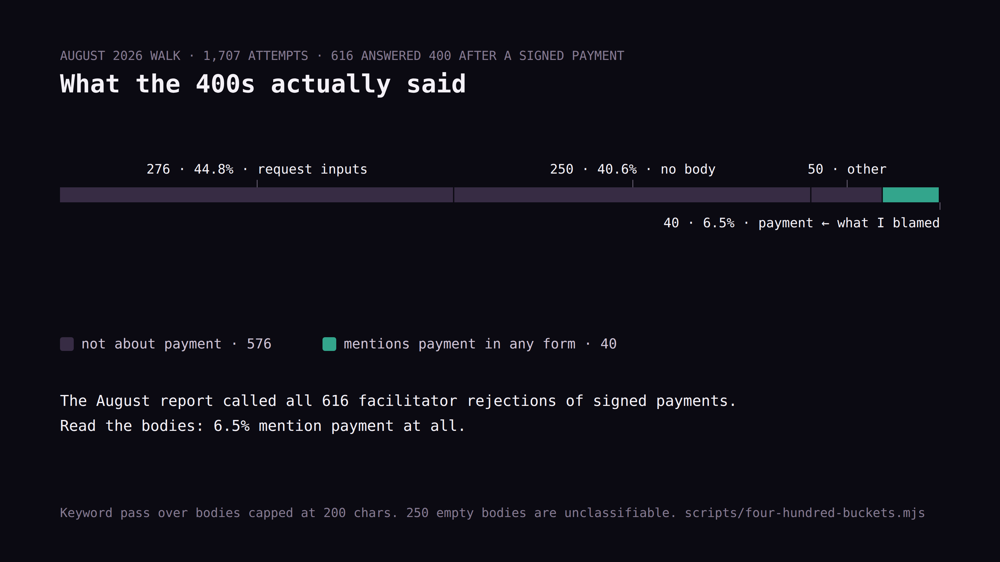
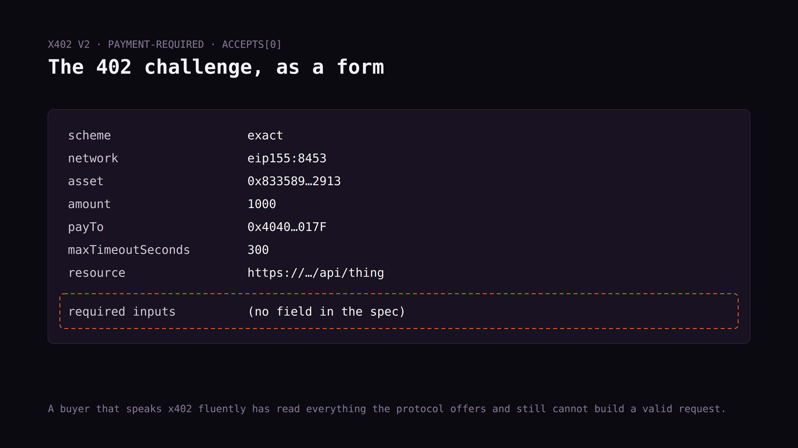
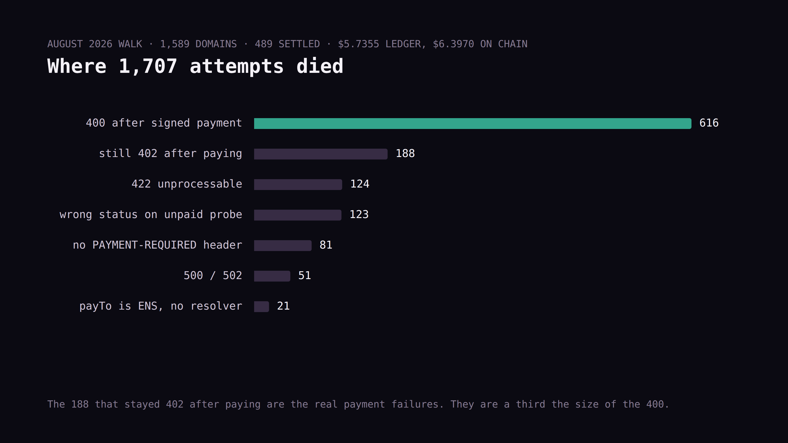

# Byline — "The biggest x402 failure isn't adoption. It's the 400."

Revised 2026-09-10 for HackerNoon. Numbers re-derived from
`research/field-run-2026-08-18/ledger.jsonl` with
`node scripts/four-hundred-buckets.mjs`.

⚑ Carries a correction to the August field report; the dated correction
block is already in `FIELD-REPORT.md`. Link to it, and to `/corrections`
once the entry is posted there.

⚑ **Before submitting:** AI-assisted draft. Rewrite the opening and
"The gap that produces them" in your own words; set the indicator.

## Story settings

**Title options:**
1. I Made 1,707 Paid Requests to 1,589 x402 Endpoints. The Biggest Failure Wasn't Payment.
2. 616 x402 Endpoints Returned a 400 After I Paid. I Blamed the Wrong Thing.
3. x402's Biggest Failure Mode Is a Field the Spec Doesn't Have

**TL;DR:** In August 2026 I walked every reachable domain on the public
x402 list with a funded wallet: 1,589 domains, 1,707 attempts, $5.74
in the ledger. The single largest failure was HTTP 400, 616 attempts,
36% of the run. I originally reported those as facilitators rejecting
signed payments. Then I read the response bodies. Only 6.5% mention
payment at all. Most are doors refusing a request the buyer had no way
to build, because the x402 challenge has nowhere to declare required
inputs. This piece corrects my own August report and says what to do
about it.

**Meta description:** 1,707 real x402 payments, 616 HTTP 400s. The
response bodies show it wasn't the payment layer. It's a field the
challenge doesn't have, and a self-correction to my own report.

**Tags (8):** x402, ai-agents, agentic-commerce, api-design, payments,
usdc, http, web3

**Featured image:** a pie or stacked bar of the 616: 44.8% inputs /
40.6% no body / 8.1% other / 6.5% payment. The 6.5% slice labelled
"the part I blamed." Greenify.

**Canonical link:** https://scvd.store/defects/inputs-undeclared

---

# I Made 1,707 Paid Requests to 1,589 x402 Endpoints. The Biggest Failure Wasn't Payment.

Over August 18 and 19, 2026, I walked the entire walkable x402 set with
a funded wallet. **1,589 domains. 1,707 attempts. 489 successful paid
purchases. $5.7355 in the ledger.** Real USDC, real settlements, one
buyer, every request tagged with a calling-card user agent so operators
could see who knocked.

The single largest failure was HTTP 400: **616 attempts, 36.1% of the
run.** When I first wrote this up I called those "the payment is signed
per spec but the facilitator rejects it," and named facilitator
rejection the ecosystem's number one friction point.

Then I read the response bodies. That description isn't supported. I
run [scvd.store](https://scvd.store), so this is a correction to my own
[published report](LINK: FIELD-REPORT.md#correction).


*(caption in IMAGES.md)*

## What the 616 actually say

Sort every 400 body by what it complains about:

| What the door said | Count | Share |
|---|---|---|
| Missing or invalid **request inputs** | 276 | 44.8% |
| **No body at all** | 250 | 40.6% |
| Other (a usage hint) | 50 | 8.1% |
| Anything mentioning payment, signature, nonce, authorization | 40 | **6.5%** |

Six and a half percent. Most of x402's biggest failure mode isn't a
payment problem. It's doors refusing requests that were malformed
before payment ever entered the picture.

Real examples, verbatim from the ledger:

```json
{"error":"Missing required field: text"}
{"error":"channel query param required","price":"$0.002",
 "example_query":{"channel":"job-99"}}
{"error":"provide two colors: ?fg=#111111&bg=#ffffff (hex or rgb())"}
{"error":"invalid_request_body","message":"Field \"url\" is required.",
 "charged":false,"payment_accepted":false}
```

Every one of those doors is behaving reasonably. It needs a parameter.
It didn't get one. It said so.

## The gap that produces them

This is a protocol story and not a "crawler sent empty requests" story,
but I want to be straight about my own exposure: **my walker sent no
request body.** It read the 402 challenge, signed against the terms,
and retried. That's what an x402 client is specified to do.

And that's the gap. **The x402 challenge has nowhere to put required
inputs.** It carries scheme, network, asset, amount, payTo, timeout,
resource. There's no field that says "this endpoint also needs a
`channel` query parameter." A buyer that speaks x402 fluently and
nothing else has read everything the protocol offers and still can't
build a valid request.

The information usually exists. Look at that third example again: the
door helpfully names its catalog. Others point at `/openapi.json`. But
it lives out of band, in a document the payment flow never references,
in a format that varies per operator.

So the sequence goes: agent finds endpoint, reads challenge, signs,
pays, gets 400. The money moved. The door has no idea it just failed a
customer who did everything the spec asked.


*(caption in IMAGES.md)*

Two more numbers from the same walk. Of 1,053 endpoints that returned a
402 to an unpaid probe, only **345, 32.8%, carried a parseable
payment-requirements structure.** And 250 of the 616 four-hundreds came
back with an empty body, so even the diagnosis is gone: the buyer sees
a bare status code and can't tell a missing parameter from a rejected
signature.

We named this class [`inputs-undeclared`](https://scvd.store/defects/inputs-undeclared)
in our defect vocabulary before I understood how much of the failure
surface it was. It's the most expensive thing on that list and it's
invisible from the seller's side. **In your logs, a buyer who couldn't
guess your parameters and a buyer who never wanted your product look
identical.**

## The rest of the taxonomy

From the same 1,707 attempts:

| Failure | Count |
|---|---|
| 400 (above) | 616 |
| Still 402 after paying | 188 |
| 422 unprocessable | 124 |
| No PAYMENT-REQUIRED header on a 402 | 81 |
| Wrong status on the unpaid probe (400/404/200/405) | 123 |
| 500 / 502 | 51 |
| `payTo` is an ENS name, no resolver | 21 |

The 188 "still 402 after paying" are the ones that look like real
payment failures, and at 11% they're a real problem. But they're a
third the size of the 400.

The ENS one gets a sentence because it's so cheap to avoid: 21
endpoints published a human-readable name where a client needs bytes
to sign over. Put the address in the challenge.


*(caption in IMAGES.md)*

## What to do about it

**If you operate an endpoint:** answer a 402 probe with a body that
names your required inputs, even though the spec has no field for it.
Put them in `description`, put them in an `extra` object, anywhere a
parser can reach. And give every 400 a body that names the missing
field. The 250 silent ones are the worst doors in the run, not because
they're broken but because they're undiagnosable. Two of the examples
above are close to ideal by contrast: they name the field and show an
example value.

**If you build a buyer:** treat a 400 as reject-and-move-on, not
fix-and-retry. Re-signing the same payment against the same door won't
help, and the economics say your time is better spent elsewhere: cheap
endpoints ($0.01 to $0.05) settled at about 34%, and above $0.05
success collapsed to near nothing. Don't trust `accepts[0]`; you'll
meet at least four challenge structures and only about a third use the
standard field. Before you pay a door the first time, check whether it
publishes an OpenAPI document or a catalog. That's where its inputs are
hiding.

**If you work on the spec:** a declared-inputs field in the challenge
would remove more real-world failure than any other single change I saw
in 1,707 attempts.

## What this doesn't prove

One buyer, one wallet, two days in August, one facilitator path, and a
walker that deliberately sent no request body. A client that fetched
each endpoint's OpenAPI document first would have a different failure
profile. That's the point of the piece and also its limit, and I
haven't run that experiment.

The categorization is a keyword pass over stored bodies capped at 200
characters, not a hand-read of all 616. The 250 empty bodies are
unclassifiable by construction, and some of them may be facilitator
rejections, which would raise the 6.5%. It couldn't raise it above
about 47% even if every silent one were a payment failure.

Every entry is in [the public ledger](LINK: ledger.jsonl) with its URL,
status, error and body preview, so anyone can re-derive these buckets
with different rules. [The script is one file.](LINK: four-hundred-buckets.mjs)
I'd like to see someone get a different answer.

One last note on the ledger itself: it under-reports. Reconciling
against Base showed **669 on-chain transfers totalling $6.3970**
against 489 paid entries and $5.7355 recorded, a 10.3% gap concentrated
at the cheapest tier. The script logged after the response, so any
settlement whose response never arrived settled on chain and was
written down as a failure. If your agent logs its spending after the
response, so does yours.

---

*I run scvd.store. Earlier pieces:
[AURa](https://hackernoon.com/ai-agents-are-customers-now-aura-is-how-i-take-notes-on-how-they-shop)
and [35 x402 hosts served no signed offer](https://dev.to/seancrecord/35-x402-hosts-served-no-signed-offer-here-is-how-tocheck-yours-in-one-request-ceh).*
